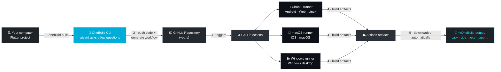

<div align="center">

# ⚡ OneBuild

</div>

<div dir="rtl" align="right">

**ساخت اپ فلاتر برای اندروید، iOS، وب، ویندوز، لینوکس و macOS — از روی هر کامپیوتری، بدون نیاز به مک برای ساخت iOS.**

OneBuild یک ابزار خط‌فرمان بدون هیچ وابستگی بیرونی است که از GitHub Actions (شامل رانرهای واقعی macOS) به‌عنوان مزرعه‌ی ساخت (build farm) شخصیِ شما استفاده می‌کند. شما فقط به چند سؤال جواب می‌دهید؛ بقیه‌ی کار را OneBuild انجام می‌دهد.

</div>

<div align="center">

[](https://go.dev)
[](LICENSE)
[](https://github.com/ghaderi0x/onebuild/releases/latest)
[](#-دانلود-و-اجرا-توصیه‌شده)
[](#-چرا-onebuild)

**[English](README.md) · [فارسی](README.fa.md)**

</div>

<br>

<div align="center">

<!-- 🎬 این خط را با گیف دموی خودتان جایگزین کنید -->
<!-- نمونه:  -->


</div>

<br>

---

<div dir="rtl" align="right">

## 📚 فهرست مطالب

- [چرا OneBuild](#-چرا-onebuild)
- [نحوه‌ی کارکرد](#-نحوهی-کارکرد)
- [پیش‌نیازها](#-پیشنیازها)
- [دانلود و اجرا (توصیه‌شده)](#-دانلود-و-اجرا-توصیهشده--بدون-نیاز-به-go)
  - [ویندوز (پاورشل) — قدم به قدم](#ویندوز-پاورشل--قدم-به-قدم)
  - [macOS / لینوکس](#macos--لینوکس)
- [ساخت از سورس (برای برنامه‌نویسان Go)](#-ساخت-از-سورس-برای-برنامهنویسان-go)
  - [ویندوز (پاورشل) — قدم به قدم](#ویندوز-پاورشل--قدم-به-قدم-۲)
  - [macOS / لینوکس](#macos--لینوکس-۲)
- [شروع سریع](#-شروع-سریع)
- [راهنمای گام‌به‌گام](#-راهنمای-گامبهگام)
  - [۱. ساخت توکن گیت‌هاب](#۱-ساخت-توکن-گیتهاب)
  - [۲. اجرای ویزارد ساخت](#۲-اجرای-ویزارد-ساخت)
  - [۳. انتخاب منبع پروژه](#۳-انتخاب-منبع-پروژه)
  - [۴. انتخاب پلتفرم‌های خروجی](#۴-انتخاب-پلتفرمهای-خروجی)
  - [۵. ساخت امضاشده‌ی iOS (اختیاری)](#۵-ساخت-امضاشدهی-ios-اختیاری)
  - [گرفتن گواهی iOS بدون مک](#گرفتن-گواهی-ios-بدون-مک)
  - [۶. رصد کردن ساخت](#۶-رصد-کردن-ساخت)
  - [۷. دریافت فایل‌های خروجی](#۷-دریافت-فایلهای-خروجی)
  - [۸. وقتی ساخت شکست می‌خورد](#۸-وقتی-ساخت-شکست-میخورد)
- [دستور `history`](#-دستور-history)
- [دستور `doctor`](#-دستور-doctor)
- [به‌روز نگه‌داشتن OneBuild](#-بهروز-نگهداشتن-onebuild)
- [همه‌ی دستورات](#-همهی-دستورات)
- [مسیر ذخیره‌سازی فایل‌ها روی سیستم شما](#-مسیر-ذخیرهسازی-فایلها-روی-سیستم-شما)
- [سؤالات متداول / رفع مشکل](#-سؤالات-متداول--رفع-مشکل)
- [گسترش به فریم‌ورک‌های دیگر](#-گسترش-به-فریمورکهای-دیگر)
- [لایسنس](#-لایسنس)

</div>

---

<div dir="rtl" align="right">

## 🤔 چرا OneBuild

توسعه‌دهندگان فلاتر روی ویندوز یا لینوکس نمی‌توانند به‌صورت محلی خروجی iOS بگیرند، چون Xcode فقط روی macOS اجرا می‌شود. خرید یک مک فقط برای انتشار خروجی iOS، برای خیلی از توسعه‌دهندگان مستقل و تیم‌های کوچک یک مانع واقعی است.

OneBuild این مشکل را با استفاده از **رانرهای میزبانیِ macOS در گیت‌هاب** (که در محدوده‌ی مصرف رایگان Actions در دسترس‌تان است) دور می‌زند — این رانرها اپ iOS شما را می‌سازند، درست مثل هر پلتفرم دیگری که فلاتر پشتیبانی می‌کند، همه از طریق یک دستور روی کامپیوتر خودتان.

| | بدون OneBuild | با OneBuild |
| --- | --- | --- |
| ساخت iOS روی ویندوز/لینوکس | ❌ ممکن نیست | ✅ بله، از طریق رانرهای macOS در Actions |
| نیاز به تولچین محلی | فلاتر + Xcode + اندروید استودیو | ❌ هیچ‌کدام — رانرهای گیت‌هاب همه را دارند |
| ساخت چندپلتفرمی | دستی، یکی‌یکی | ✅ همه‌ی خروجی‌ها موازی |
| هزینه | یک دستگاه مک (بیش از ۱۰۰۰ دلار) | دقیقه‌های رایگان GitHub Actions |

</div>

---

<div dir="rtl" align="right">

## ⚙️ نحوه‌ی کارکرد

OneBuild هیچ‌چیزی را روی سیستم خودِ شما کامپایل نمی‌کند. این ابزار یک ریموت‌کنترل سبک و امن برای GitHub Actions است: کد شما را push می‌کند، فایل ورک‌فلو را می‌نویسد، اجرا را تریگر می‌کند، و خروجی نهایی را برایتان دانلود می‌کند.

</div>



<div dir="rtl" align="right">

۱. **شما دستور `onebuild build` را اجرا می‌کنید** — یک ویزارد کوتاه و تعاملی می‌پرسد پروژه‌تان کجاست و کدام پلتفرم‌ها را می‌خواهید.

۲. **OneBuild کد شما را push می‌کند** به یک مخزن گیت‌هاب (متعلق به خودتان) و یک فایل `.github/workflows/onebuild.yml` متناسب با پلتفرم‌های انتخابی شما اضافه می‌کند.

۳. **GitHub Actions کار را به دست می‌گیرد** — یک jobِ جداگانه برای هر پلتفرم، همه به‌طور موازی روی رانرهای میزبانیِ خودِ گیت‌هاب (اوبونتو، macOS، ویندوز) اجرا می‌شوند.

۴. **هر رانر اپ شما را می‌سازد** با تولچین واقعی Flutter/Xcode/Gradle، و نتیجه را به‌عنوان یک artifact آپلود می‌کند.

۵. **OneBuild منتظر می‌ماند و بعد همه‌چیز را دانلود می‌کند** داخل یک پوشه با برچسب زمانی، روی سیستم خودتان — دیگر نیازی نیست دستی داخل رابط کاربری Actions کلیک کنید.

مواردی که به اعتبارنامه‌ی اپل، توکن گیت‌هاب و مواد امضا مربوط می‌شوند، یا روی سیستم خودتان (رمزنگاری‌شده) باقی می‌مانند یا داخل Secretهای رمزنگاری‌شده‌ی خودِ گیت‌هاب — سروری متعلق به OneBuild اصلاً وجود ندارد؛ چیزی برای اعتماد کردن جز حساب گیت‌هاب خودتان نیست.

</div>

---

<div dir="rtl" align="right">

## ✅ پیش‌نیازها

- یک **حساب گیت‌هاب** (پلن رایگان هم کار می‌کند — دقیقه‌های Actions ممکن است محدود باشند، به [سؤالات متداول](#-سؤالات-متداول--رفع-مشکل) نگاه کنید).
- **همین و بس.** OneBuild برای اجرا شدن نیازی به فلاتر، Xcode، اندروید استودیو یا حتی گیت روی سیستم شما ندارد — فقط باید این‌ها روی رانر GitHub Actions باشند، که گیت‌هاب خودش آن‌ها را فراهم می‌کند.

</div>

---

<div dir="rtl" align="right">

## 📦 دانلود و اجرا (توصیه‌شده — بدون نیاز به Go)

سریع‌ترین مسیر همین است: یک فایل اجرایی آماده بگیرید و اجرایش کنید. **برای این روش اصلاً نیازی به نصب Go، Git یا فلاتر ندارید.**

اگر می‌خواهید خودتان OneBuild را از سورس کامپایل کنید، به بخش [🛠️ ساخت از سورس](#-ساخت-از-سورس-برای-برنامهنویسان-go) بروید — دستورات این دو بخش را با هم قاطی نکنید.

### ویندوز (پاورشل) — قدم به قدم

**۱. پاورشل را باز کنید.** روی دکمه‌ی Start کلیک کنید، بنویسید `PowerShell` و اینتر بزنید (همان "Windows PowerShell" آبی‌رنگ معمولی کافی است — نیازی نیست آن را با دسترسی Administrator اجرا کنید).

**۲. یک پوشه برای OneBuild بسازید و وارد آن شوید.** کل این بلاک را یک‌جا کپی‌پیست کنید — پوشه‌ی `Tools\OneBuild` را می‌سازد و به داخل آن می‌رود:

</div>

```powershell
New-Item -ItemType Directory -Force -Path "$env:USERPROFILE\Tools\OneBuild" | Out-Null
Set-Location "$env:USERPROFILE\Tools\OneBuild"
```

<div dir="rtl" align="right">

**۳. آخرین نسخه‌ی ویندوز را دانلود کنید.** این آدرس همیشه به تازه‌ترین نسخه اشاره می‌کند، پس هیچ‌وقت لازم نیست شماره‌ی نسخه را دستی پیدا کنید:

</div>

```powershell
Invoke-WebRequest -Uri "https://github.com/ghaderi0x/onebuild/releases/latest/download/onebuild-windows-amd64.exe" -OutFile "onebuild.exe"
```

<div dir="rtl" align="right">

**۴. بلاک فایل را باز کنید (Unblock).** ویندوز هر فایلی را که از اینترنت دانلود شود به‌صورت پیش‌فرض «غیرقابل‌اعتماد» علامت می‌زند — این یک دستور آن پرچم را پاک می‌کند تا پاورشل هر بار که اجرایش می‌کنید هشدار ندهد:

</div>

```powershell
Unblock-File -Path ".\onebuild.exe"
```

<div dir="rtl" align="right">

**۵. تست کنید که کار می‌کند:**

</div>

```powershell
.\onebuild.exe version
```

<div dir="rtl" align="right">

باید یک شماره نسخه چاپ شود. اگر به‌جایش یک پاپ‌آپ آبی‌رنگ **«Windows protected your PC»** از سمت SmartScreen دیدید، روی **More info** و بعد **Run anyway** کلیک کنید — این برای یک ابزار متن‌باز بدون گواهی امضای کدِ پولی طبیعی است، و فقط یک‌بار لازم است این کار را انجام دهید.

**۶. (پیشنهادی) OneBuild را به PATH اضافه کنید**، تا بتوانید از هر پوشه‌ای فقط با نوشتن `onebuild` آن را اجرا کنید، بدون نیاز به تایپ مسیر کامل هر بار:

</div>

```powershell
[Environment]::SetEnvironmentVariable("Path", "$env:Path;$env:USERPROFILE\Tools\OneBuild", "User")
```

<div dir="rtl" align="right">

**۷. این پنجره‌ی پاورشل را ببندید و یک پنجره‌ی کاملاً جدید باز کنید** (تغییر PATH فقط روی پنجره‌های جدید اعمال می‌شود)، سپس تأیید کنید:

</div>

```powershell
onebuild version
```

<div dir="rtl" align="right">

اگر شماره‌ی نسخه چاپ شد، کارتان تمام است — به بخش [🚀 شروع سریع](#-شروع-سریع) بروید.

### macOS / لینوکس

فایل متناسب با سیستم خودتان را دانلود کنید:

| پلتفرم | نام فایل |
| --- | --- |
| macOS (اپل سیلیکون) | `onebuild-macos-arm64` |
| macOS (اینتل) | `onebuild-macos-intel` |
| لینوکس (x86_64) | `onebuild-linux-amd64` |
| لینوکس (arm64) | `onebuild-linux-arm64` |

هر بلاک زیر را متناسب با پلتفرم خودتان، یک‌جا کپی‌پیست کنید (دانلود، اجرایی‌کردن فایل و تست کردن آن، همه با هم انجام می‌شود — فقط اگر اسم فایل شما فرق دارد، همان را جایگزین کنید):

</div>

```bash
curl -L -o onebuild "https://github.com/ghaderi0x/onebuild/releases/latest/download/onebuild-linux-amd64"
chmod +x onebuild
./onebuild version
```

```bash
# نمونه برای macOS (اپل سیلیکون)
curl -L -o onebuild "https://github.com/ghaderi0x/onebuild/releases/latest/download/onebuild-macos-arm64"
chmod +x onebuild
./onebuild version
```

<div dir="rtl" align="right">

روی macOS، اگر هشداری دیدید که فایل به‌خاطر «توسعه‌دهنده‌ی ناشناس» قابل باز شدن نیست، به **System Settings → Privacy & Security** بروید، پایین را اسکرول کنید و کنار هشدار OneBuild روی **«Allow Anyway»** کلیک کنید — سپس دوباره `./onebuild version` را اجرا کنید.

اختیاری — فایل را به PATH منتقل کنید تا از هر جایی بتوانید `onebuild` را اجرا کنید:

</div>

```bash
sudo mv onebuild /usr/local/bin/onebuild
onebuild version
```

---

<div dir="rtl" align="right">

## 🛠️ ساخت از سورس (برای برنامه‌نویسان Go)

فقط اگر دقیقاً می‌خواهید **OneBuild را خودتان با Go کامپایل کنید** این بخش را دنبال کنید — مثلاً برای امتحان کردن یک تغییرِ هنوز منتشرنشده، یا برای بازبینی کد پیش از اجرا. اکثر افراد باید همان بخش [📦 دانلود و اجرا](#-دانلود-و-اجرا-توصیهشده--بدون-نیاز-به-go) را دنبال کنند؛ دستورات این دو بخش را با هم ترکیب نکنید.

**پیش‌نیاز:** [Go نسخه‌ی ۱.۲۱ یا بالاتر](https://go.dev/dl/) و [Git](https://git-scm.com/downloads) روی سیستم شما نصب باشد. برای بررسی اینکه از قبل نصب دارید یا نه:

</div>

```powershell
go version
git --version
```

<div dir="rtl" align="right">

### ویندوز (پاورشل) — قدم به قدم

**۱. پاورشل را باز کنید** (Start → تایپ `PowerShell` → اینتر).

**۲. یک پوشه برای کار انتخاب کنید و مخزن را کلون کنید** — کل این بلاک را یک‌جا کپی‌پیست کنید:

</div>

```powershell
New-Item -ItemType Directory -Force -Path "$env:USERPROFILE\Projects" | Out-Null
Set-Location "$env:USERPROFILE\Projects"
git clone https://github.com/ghaderi0x/onebuild
Set-Location onebuild
```

<div dir="rtl" align="right">

**۳. فایل اجرایی را بسازید:**

</div>

```powershell
go build -o onebuild.exe .
```

<div dir="rtl" align="right">

این دستور فایل `onebuild.exe` را دقیقاً داخل همان پوشه‌ی `onebuild` می‌سازد — خود فرآیند ساخت معمولاً فقط چند ثانیه طول می‌کشد.

**۴. آن را تست کنید:**

</div>

```powershell
.\onebuild.exe version
```

<div dir="rtl" align="right">

**۵. (پیشنهادی) آن را به PATH اضافه کنید** تا بتوانید از هر جایی `onebuild` را اجرا کنید، درست مثل فایل دانلودی بالا:

</div>

```powershell
[Environment]::SetEnvironmentVariable("Path", "$env:Path;$env:USERPROFILE\Projects\onebuild", "User")
```

<div dir="rtl" align="right">

پاورشل را ببندید و دوباره باز کنید، سپس با `onebuild version` تأیید کنید.

### macOS / لینوکس

</div>

```bash
git clone https://github.com/ghaderi0x/onebuild
cd onebuild
go build -o onebuild .
./onebuild version
```

<div dir="rtl" align="right">

به‌صورت اختیاری آن را به PATH منتقل کنید:

</div>

```bash
sudo mv onebuild /usr/local/bin/onebuild
```

---

<div dir="rtl" align="right">

## 🚀 شروع سریع

</div>

```powershell
onebuild auth login     # یک‌بار: توکن گیت‌هاب خود را وارد کنید
onebuild build           # به چند سؤال جواب دهید، خروجی‌های خود را بگیرید
onebuild history          # همه‌ی چیزهایی که قبلاً ساخته‌اید را ببینید
```

<div dir="rtl" align="right">

کل جریان کار همین است. ادامه‌ی این سند هر مرحله را با جزئیات بیشتر توضیح می‌دهد.

</div>

---

<div dir="rtl" align="right">

## 📖 راهنمای گام‌به‌گام

### ۱. ساخت توکن گیت‌هاب

اولین باری که `onebuild build` را اجرا می‌کنید (یا مستقیماً `onebuild auth login`)، OneBuild از شما یک **GitHub Personal Access Token** می‌خواهد — این همان چیزی است که به OneBuild اجازه می‌دهد از طرف شما مخزن بسازد و ساخت را شروع کند.

۱. به آدرس **https://github.com/settings/tokens/new** بروید.
۲. یک نام دلخواه برایش بگذارید، مثلاً `onebuild`.
۳. یک تاریخ انقضا انتخاب کنید که برایتان راحت است (یا «No expiration» اگر نمی‌خواهید این کار را دوباره تکرار کنید).
۴. زیر بخش **scopes**، این دو را تیک بزنید:
   - `repo` (کنترل کامل مخازن خصوصی)
   - `workflow` (به‌روزرسانی فایل‌های ورک‌فلوی GitHub Actions)
۵. روی **Generate token** کلیک کنید، سپس آن را کپی کنید — گیت‌هاب فقط یک‌بار آن را نشان می‌دهد.
۶. آن را هنگامی که OneBuild می‌پرسد، وارد کنید.

OneBuild این توکن را رمزنگاری می‌کند و در `~/.onebuild/` روی سیستم خودتان ذخیره می‌کند (روی ویندوز این مسیر `%USERPROFILE%\.onebuild\` است). دیگر در اجراهای بعدی این سؤال پرسیده نمی‌شود. برای حذف آن در هر زمان:

</div>

```powershell
onebuild logout
```

<div dir="rtl" align="right">

> اگر به‌جای توکن کلاسیک می‌خواهید از توکن fine-grained استفاده کنید، آن هم کار می‌کند — به شرطی که دسترسی خواندن/نوشتن به **Contents**، **Actions** و **Secrets** داشته باشد، و اجازه‌ی ساخت مخزن جدید هم داشته باشد (توکن‌های fine-grained برای این بخش آخر به دسترسی «All repositories» همراه با **Administration: write** نیاز دارند). توکن‌های کلاسیک با scopeهای `repo` و `workflow` ساده‌ترند و همان چیزی‌اند که مراحل بالا فرض کرده‌اند.

### ۲. اجرای ویزارد ساخت

</div>

```powershell
onebuild build
```

<div dir="rtl" align="right">

بنر OneBuild را می‌بینید، و بعد یک سری سؤال کوتاه:

```
? Where is your Flutter project?
    1) A local folder on this computer
    2) An existing GitHub repository (already pushed)
> Enter number: 1

? Path to your Flutter project folder [.]: C:\Users\you\projects\my_app
? App name (used for labels and history) [my_app]: My App
```

### ۳. انتخاب منبع پروژه

- **پوشه‌ی محلی** — OneBuild را به ریشه‌ی پروژه‌ی فلاتر خود اشاره کنید (همان پوشه‌ای که `pubspec.yaml` در آن است). OneBuild این کارها را انجام می‌دهد:
  - یک مخزن جدید گیت‌هاب برای شما می‌سازد (شما اسم و خصوصی/عمومی بودنش را انتخاب می‌کنید)،
  - یک فایل `.github/workflows/onebuild.yml` به پروژه‌تان اضافه می‌کند،
  - همه‌چیز را آپلود می‌کند، ولی پوشه‌های `build/`، `.dart_tool/`، `Pods/`، `.gradle/`، `node_modules/` و موارد مشابه را که نباید در کنترل نسخه باشند، رد می‌کند.
- **مخزن گیت‌هاب موجود** — اگر پروژه‌تان از قبل روی گیت‌هاب push شده، فقط آدرس آن (یا `owner/repo`) را به OneBuild بدهید. فایل‌های شما دست‌نخورده می‌مانند؛ فقط فایل ورک‌فلو اضافه/به‌روز می‌شود و یک اجرا تریگر می‌شود.

### ۴. انتخاب پلتفرم‌های خروجی

```
? Which outputs do you want to build? (comma separated numbers, e.g. 1,3)
    1) Android (.apk)
    2) Android App Bundle (.aab)
    3) iOS - unsigned build (.ipa, needs resigning)
    4) iOS - signed with your certificate (.ipa)
    5) Web
    6) Windows desktop
    7) Linux desktop
    8) macOS desktop
> Enter numbers: 1,4,5
```

هر تعداد که بخواهید می‌توانید در یک اجرا انتخاب کنید — هرکدام یک job جداگانه در ورک‌فلوی ساخته‌شده می‌شود، و همه به‌صورت **موازی** روی سرورهای گیت‌هاب اجرا می‌شوند.

### ۵. ساخت امضاشده‌ی iOS (اختیاری)

اگر گزینه‌ی **iOS امضاشده** را انتخاب کرده باشید، OneBuild ابتدا **Team ID** اپل شما و روش export (`ad-hoc`, `app-store`, `development` یا `enterprise`) را می‌پرسد.

سپس بررسی می‌کند آیا مخزن شما از قبل چهار Secret موردنیاز GitHub Actions را دارد یا نه، و اگر چیزی کم باشد دقیقاً همان را چاپ می‌کند:

```
⚠ This repository is missing 4 required secret(s) for signed iOS builds:
   - IOS_CERTIFICATE_BASE64
   - IOS_CERTIFICATE_PASSWORD
   - IOS_PROVISIONING_PROFILE_BASE64
   - KEYCHAIN_PASSWORD

Add them at:
https://github.com/you/your-repo/settings/secrets/actions/new
```

نحوه‌ی گرفتن هر مقدار:

| Secret | نحوه‌ی گرفتن آن |
| --- | --- |
| `IOS_CERTIFICATE_BASE64` | به بخش [گرفتن گواهی iOS بدون مک](#گرفتن-گواهی-ios-بدون-مک) در ادامه نگاه کنید. |
| `IOS_CERTIFICATE_PASSWORD` | همان پسوردی که هنگام اجرای `onebuild ios-cert package` انتخاب می‌کنید. |
| `IOS_PROVISIONING_PROFILE_BASE64` | فایل `.mobileprovision` متناظر را از **https://developer.apple.com/account/resources/profiles/list** دانلود کنید، سپس `onebuild ios-cert encode` را اجرا کنید. |
| `KEYCHAIN_PASSWORD` | هر پسورد دلخواهی — فقط برای محافظت از یک keychain موقت در طول اجرای CI استفاده می‌شود و جای دیگری کاربرد ندارد. |

وقتی Secretها اضافه شدند، به پرامپت OneBuild برگردید و گزینه‌ی **«I've added them, check again.»** را انتخاب کنید. همچنین می‌توانید از گزینه‌ی iOS امضاشده صرف‌نظر کنید و با باقی پلتفرم‌های انتخابی ادامه دهید، یا کلاً لغو کنید.

> گزینه‌ی iOS امضانشده اصلاً نیازی به حساب اپل ندارد، اما فایل `.ipa` نتیجه‌ی آن **همان‌طوری روی دستگاه قابل نصب نیست**. باید بعداً با ابزاری مثل AltStore، Sideloadly یا TrollStore دوباره امضا شود — این محدودیتِ خودِ ساخت‌های iOS امضانشده است، نه چیزی که OneBuild بتواند دورش بزند.

### گرفتن گواهی iOS بدون مک

گرفتن **گواهی distribution** اپل معمولاً یعنی باز کردن Keychain Access روی یک مک برای ساخت یک Certificate Signing Request یا CSR. این در واقع یک الزام اپل نیست — فقط کاری است که Keychain Access به‌صورت خودکار انجام می‌دهد. یک CSR یک فرمت فایل استاندارد (PKCS#10) است، و OneBuild خودش می‌تواند یکی بسازد، روی هر سیستم‌عاملی:

</div>

```powershell
onebuild ios-cert csr
```

<div dir="rtl" align="right">

این دستور ایمیل Apple ID، اسم و کد کشور شما را می‌پرسد، سپس یک کلید خصوصی و یک فایل `.certSigningRequest` به‌صورت محلی می‌سازد — در این مرحله هیچ‌چیزی به جایی ارسال نمی‌شود.

مراحل بعدی:

۱. به آدرس **https://developer.apple.com/account/resources/certificates/add** بروید.
۲. گزینه‌ی **Apple Distribution** (یا **iOS Distribution**) را انتخاب کنید.
۳. فایل `.certSigningRequest` که OneBuild ساخت را آپلود کنید.
۴. گواهی‌ای که اپل به شما می‌دهد (یک فایل `.cer`) را دانلود کنید.

سپس آن را بسته‌بندی کنید:

</div>

```powershell
onebuild ios-cert package
```

<div dir="rtl" align="right">

مسیر فایل `.cer` دانلودشده و کلید خصوصیِ مرحله‌ی اول را به آن بدهید، یک پسورد انتخاب کنید، و OneBuild فایل `.p12` را می‌سازد، آن را base64 می‌کند و هر دو را ذخیره می‌کند — آماده برای گذاشتن در `IOS_CERTIFICATE_BASE64` و `IOS_CERTIFICATE_PASSWORD`.

این مرحله از `openssl` استفاده می‌کند. روی ویندوز این ابزار همراه [Git for Windows](https://gitforwindows.org/) یا WSL نصب می‌شود؛ روی macOS/لینوکس از قبل نصب است. اگر `openssl` پیدا نشود، OneBuild دقیقاً همان دو دستوری را که باید خودتان اجرا کنید چاپ می‌کند — هیچ‌چیز در این مرحله نیازی به مک ندارد.

همچنان به یک **provisioning profile** متصل به آن گواهی و شناسه‌ی بسته‌ی اپ خود نیاز دارید — آن را از **https://developer.apple.com/account/resources/profiles/list** دانلود کنید (این کار هم از روی هر سیستم‌عاملی با مرورگر ممکن است)، سپس:

</div>

```powershell
onebuild ios-cert encode path\to\profile.mobileprovision
```

<div dir="rtl" align="right">

تا مقدار base64 لازم برای `IOS_PROVISIONING_PROFILE_BASE64` را بگیرید.

### ۶. رصد کردن ساخت

وقتی همه‌چیز آپلود شد و ورک‌فلو کامیت شد، OneBuild به‌صورت خودکار اجرای مربوطه در GitHub Actions را پیدا می‌کند و منتظرش می‌ماند، در حالی که وضعیت زنده و زمان سپری‌شده را نشان می‌دهد:

```
✔ Workflow started: https://github.com/you/your-repo/actions/runs/123456
⠙ Building on GitHub Actions... status: in_progress (3m12s elapsed)
```

ساخت‌های چندپلتفرمی می‌توانند از چند دقیقه (فقط اندروید) تا ۲۰ تا ۳۰ دقیقه (چند پلتفرم با هم شامل iOS/macOS/ویندوز/لینوکس) طول بکشند — چون هر رانر میزبانی‌شده باید تولچین خودش را از صفر آماده کند؛ این کاملاً طبیعی است و نشانه‌ی گیر کردن چیزی نیست. می‌توانید با خیال راحت ترمینال را در پس‌زمینه باز بگذارید.

### ۷. دریافت فایل‌های خروجی

وقتی اجرا تمام شد، OneBuild هر job را با نتیجه‌اش لیست می‌کند:

```
✔ Android (.apk)   (https://github.com/you/your-repo/actions/runs/.../job/...)
✔ Web              (...)
✖ iOS - signed with your certificate (.ipa)  (...)
```

سپس هر artifact موفق را دانلود می‌کند داخل:

```
~/OneBuild-output/<app-name>-<timestamp>/
```

روی ویندوز این مسیر `%USERPROFILE%\OneBuild-output\<app-name>-<timestamp>\` است، با یک زیرپوشه به ازای هر artifact (`app-android-apk\`، `app-web\` و غیره) که فایل واقعیِ `.apk`، `.aab`، `.ipa` یا bundle مربوط به آن پلتفرم را در خود دارد.

### ۸. وقتی ساخت شکست می‌خورد

برای هر job که شکست بخورد، OneBuild لاگ همان job (نه کل اجرا، پس شکست اندروید لاگ iOS را زیر خودش دفن نمی‌کند) را می‌گیرد و این‌ها را به شما نشان می‌دهد:

- کدام job شکست خورده، و یک لینک مستقیم به آن،
- هر annotation ساختاریافته‌ی گیت‌هاب روی آن job (مثلاً از `flutter analyze`، یا دستورات ورک‌فلوی `::error file=...,line=...::message`) — این‌ها مستقیماً از Checks API خودِ گیت‌هاب می‌آیند، پس دقیق‌اند نه حدسی،
- آخرین خط‌های لاگ خام همان job، مستقیماً در ترمینال شما.

OneBuild عمداً **سعی نمی‌کند علت را حدس بزند یا راه‌حلی پیشنهاد بدهد** — شکست‌های ساخت آن‌قدر متنوع و وابسته به شرایط‌اند که یک تطبیق کلیدواژه‌ای ساده نمی‌تواند قابل‌اعتماد باشد، و یک حدس اشتباه بدتر از هیچ حدسی است. شما لاگ واقعی را دارید؛ خودتان (یا یک موتور جست‌وجو، یا خودِ پیام خطای Flutter/Gradle/Xcode) بهترین قضاوت‌کننده درباره‌ی معنای آن هستید.

اگر بخواهید یک نسخه برای نگه‌داشتن یا اشتراک‌گذاری داشته باشید، OneBuild می‌تواند یک PDF شامل jobهای شکست‌خورده، annotationها و دنباله‌ی لاگ‌ها ذخیره کند — مستقیماً روی **دسکتاپ** شما:

```
✔ PDF saved to C:\Users\you\Desktop\onebuild-error-report-20260901-111652-038.pdf
```

</div>

---

<div dir="rtl" align="right">

## 📜 دستور `history`

</div>

```powershell
onebuild history
```

<div dir="rtl" align="right">

هر ساخت گذشته را نشان می‌دهد: اسم اپ، لینک مخزن، لینک اجرا، تاریخ، و اینکه هر artifact دانلودشده کجای سیستم شما قرار گرفته.

```
1. [✔] My App
   Repo:   https://github.com/you/my-app
   Run:    https://github.com/you/my-app/actions/runs/123456
   Date:   2026-08-31 10:15
   Artifacts:
     - app-android-apk: C:\Users\you\OneBuild-output\my-app-20260831-101512\app-android-apk
     - app-web: C:\Users\you\OneBuild-output\my-app-20260831-101512\app-web
```

## 🩺 دستور `doctor`

</div>

```powershell
onebuild doctor
```

<div dir="rtl" align="right">

یک بررسی سریع محیط سیستم — قبل از اولین اجرا یا وقتی چیزی درست کار نمی‌کند مفید است:

```
Info: OS/Arch: windows/amd64
✔ git is installed (will be used for faster uploads)
✔ Local config directory is writable (%USERPROFILE%\.onebuild)
✔ api.github.com is reachable
✔ A GitHub session is saved
```

## 🔄 به‌روز نگه‌داشتن OneBuild

هر بار که دستوری مثل `onebuild build` را اجرا می‌کنید، OneBuild یک بررسی سریع (چند ثانیه، و اگر آفلاین باشید بی‌سروصدا رد می‌شود) در برابر آخرین release همین مخزن انجام می‌دهد. اگر نسخه‌ی جدیدتری وجود داشته باشد:

```
⚠ A newer version (v1.1.0) is available. Run 'onebuild update' to update.
```

برای به‌روزرسانی:

</div>

```powershell
onebuild update
```

<div dir="rtl" align="right">

این دستور فایل اجرایی درست برای سیستم‌عامل/معماری شما را از آخرین release گیت‌هاب دانلود می‌کند و همان فایلی را که در حال اجراست جایگزین می‌کند — بدون نیاز به نصب دوباره یا دانلود دستی.

</div>

---

<div dir="rtl" align="right">

## 🧾 همه‌ی دستورات

</div>

```
onebuild build              Start the interactive build wizard
onebuild history             Show past builds
onebuild auth login           One-time: save a GitHub token for future runs
onebuild auth logout           Remove the saved GitHub token
onebuild logout                   Shortcut for 'onebuild auth logout'
onebuild auth status             Show who is currently logged in
onebuild ios-cert csr           Generate an Apple certificate request (no Mac needed)
onebuild ios-cert package       Package a downloaded certificate into a .p12
onebuild ios-cert encode        Base64-encode a file (e.g. a provisioning profile)
onebuild doctor                Check your local environment
onebuild update                  Update OneBuild to the latest version
onebuild version                Print the version number
onebuild help                    Show this list
```

<div dir="rtl" align="right">

## 🗂️ مسیر ذخیره‌سازی فایل‌ها روی سیستم شما

| مسیر | محتوا |
| --- | --- |
| `~/.onebuild/session.json` | نام کاربری گیت‌هاب و توکن رمزنگاری‌شده‌ی شما |
| `~/.onebuild/local.key` | کلید رمزنگاری محلی مورد استفاده برای توکن بالا |
| `~/.onebuild/history.json` | تاریخچه‌ی ساخت‌های شما |
| `~/OneBuild-output/ios-cert/` | کلید خصوصی، CSR، گواهی و فایل provisioning profile حاصل از `onebuild ios-cert` |
| `~/OneBuild-output/` | artifactهای ساخت دانلودشده |
| `~/Desktop/` | گزارش‌های خطای PDF، هروقت درخواست بدهید |

روی ویندوز، `~` معادل `%USERPROFILE%` است (معمولاً `C:\Users\<شما>`).

هیچ‌چیز اینجا به‌جز تماس‌های مستقیم HTTPS با `api.github.com` به جایی ارسال نمی‌شود (و فقط در زمان اجرای `onebuild update`، برای دانلود فایل اجرایی جدید از بخش Releases همین مخزن).

> **یک نکته درباره‌ی ذخیره‌سازی محلیِ توکن**: توکن گیت‌هابِ ذخیره‌شده با یک کلید تولیدشده‌ی محلی که دقیقاً کنارش قرار دارد (`~/.onebuild/local.key`) رمزنگاری می‌شود. این کار از بازبینی سرسری (مثلاً باز کردن فایل در یک ویرایشگر متنی) جلوگیری می‌کند، اما جایگزین رمزنگاری کامل دیسک نیست — هر کسی که به همان سطح از دسترسیِ حساب کاربری شما دسترسی داشته باشد که بتواند فایل رمزنگاری‌شده را بخواند، می‌تواند کلید کنار آن را هم بخواند. با پوشه‌ی `~/.onebuild/` همان‌طور رفتار کنید که با هر اعتبارنامه‌ی دیگری روی سیستم خود رفتار می‌کنید.

</div>

---

<div dir="rtl" align="right">

## ❓ سؤالات متداول / رفع مشکل

<details>
<summary><b>آیا به یک پلن پولی گیت‌هاب نیاز دارم؟</b></summary>
<br>
نه. مخازن عمومی دقیقه‌های نامحدود و رایگان Actions دارند؛ مخازن خصوصی در پلن رایگان یک سقف ماهانه دارند (در زمان نگارش این متن، ۲٬۰۰۰ دقیقه در ماه) که معمولاً برای پروژه‌های شخصی کاملاً کافی است. ساختن چند پلتفرم هم‌زمان، به‌خصوص jobهای macOS/iOS، سریع‌تر از اندروید/وب به‌تنهایی دقیقه مصرف می‌کند.
</details>

<details>
<summary><b>چرا اولین ساخت من فقط برای یک APK اندروید ۱۳ دقیقه طول کشید؟</b></summary>
<br>
این کاملاً طبیعی است، و حتی نسبتاً سریع هم هست. رانرهای میزبانی‌شده‌ی گیت‌هاب هر بار از یک ماشین تمیز شروع می‌کنند — نصب Flutter SDK، دانلود Gradle wrapper، اجزای Android SDK و وابستگی‌های پروژه‌ی شما، همه از صفر در همان اجرای اول انجام می‌شود. ساخت‌های بعدیِ همان پروژه معمولاً کمی سریع‌ترند چون پکیج‌های pub کش می‌شوند، هرچند خودِ Gradle هنوز بین اجراهای جداگانه کش نمی‌شود.
</details>

<details>
<summary><b>آیا می‌توانم از این ابزار برای یک مخزن سازمانی/شرکتی استفاده کنم؟</b></summary>
<br>
بله — وقتی از شما مخزن پرسیده می‌شود، گزینه‌ی «مخزن گیت‌هاب موجود» را انتخاب کنید و OneBuild را به آن اشاره کنید، به شرطی که توکن شما به آن دسترسی داشته باشد.
</details>

<details>
<summary><b>نسخه‌ی واقعیِ Flutter/Xcode/Gradle از کجا می‌آید؟</b></summary>
<br>
از هرچیزی که <code>subosito/flutter-action</code> روی رانر میزبانی‌شده‌ی گیت‌هاب در زمان ساخت نصب می‌کند (به‌صورت پیش‌فرض کانال <code>stable</code>) — همان ابزاری که بیشتر پایپ‌لاین‌های CI فلاتر استفاده می‌کنند.
</details>

<details>
<summary><b>آیا می‌توانم فایل ورک‌فلوی تولیدشده را بعداً ویرایش کنم؟</b></summary>
<br>
بله، این یک فایل معمولی در مسیر <code>.github/workflows/onebuild.yml</code> در مخزن شماست. اجرای دوباره‌ی <code>onebuild build</code> روی همان پروژه آن را با نسخه‌ی تازه‌ای بر اساس آخرین جواب‌های شما بازنویسی می‌کند، پس اگر خودتان دستی آن را ویرایش کرده‌اید این نکته را در نظر داشته باشید.
</details>

<details>
<summary><b>آپلود/pushِ من با خطای دسترسی شکست خورد.</b></summary>
<br>
احتمالاً توکن شما منقضی شده یا scopeهای درست را ندارد. دستور <code>onebuild logout</code> و بعد دوباره <code>onebuild auth login</code> را با یک توکن تازه که scopeهای <code>repo</code> و <code>workflow</code> را دارد اجرا کنید.
</details>

</div>

---

<div dir="rtl" align="right">

## 🧩 گسترش به فریم‌ورک‌های دیگر

نسخه‌ی ۱.۰.۰ کاملاً روی فلاتر متمرکز است، اما طراحیِ ابزار این فرض را ایزوله نگه می‌دارد: همه‌ی تعریف‌های هدف (target) و تولید YAML مربوط به GitHub Actions در `internal/workflow/` قرار دارند، جدا از کد مربوط به گیت‌هاب/آپلود/تاریخچه/رابط کاربری. اضافه کردن پشتیبانی از یک فریم‌ورک دیگر (مثل React Native یا اندروید/iOS بومی) یعنی اضافه کردن یک مجموعه‌ی هدف جدید در همان‌جا، نه دست زدن به بقیه‌ی ابزار.

</div>

---

<div dir="rtl" align="right">

## 📄 لایسنس

MIT — به فایل [LICENSE](LICENSE) نگاه کنید.

</div>

<div align="center">

ساخته‌شده با ⚡ توسط **[A.M.Ghaderi](https://github.com/ghaderi0x)**
ایشوها و PRها خوش‌آمدند: [github.com/ghaderi0x/onebuild](https://github.com/ghaderi0x/onebuild)

</div>
