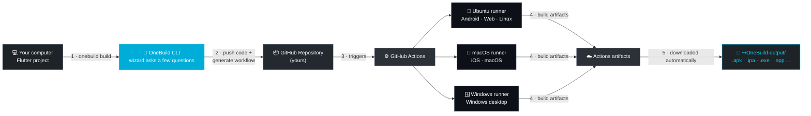

<div align="center">

# ⚡ OneBuild

**Build your Flutter app for Android, iOS, Web, Windows, Linux and macOS —
from any computer, with no Mac required for iOS.**

OneBuild is a zero-dependency CLI that turns GitHub Actions (including real
hosted macOS runners) into your personal build farm. You answer a few
questions; OneBuild does the rest.

[](https://go.dev)
[](LICENSE)
[](https://github.com/ghaderi0x/onebuild/releases/latest)
[](#-download--run-recommended--no-go-needed)
[](#-why-onebuild)

**[English](README.md) · [فارسی](README.fa.md)**

</div>

<br>

<div align="center">

<!-- 🎬 Replace this line with your demo GIF -->
<!-- Example:  -->


</div>

<br>

---

## 📚 Table of contents

- [Why OneBuild](#-why-onebuild)
- [How it works](#-how-it-works)
- [Requirements](#-requirements)
- [Download & run (recommended)](#-download--run-recommended--no-go-needed)
  - [Windows (PowerShell) — step by step](#windows-powershell--step-by-step)
  - [macOS / Linux](#macos--linux)
- [Build from source (for Go developers)](#-build-from-source-for-go-developers)
  - [Windows (PowerShell) — step by step](#windows-powershell--step-by-step-1)
  - [macOS / Linux](#macos--linux-1)
- [Quick start](#-quick-start)
- [Step-by-step guide](#-step-by-step-guide)
  - [1. Create a GitHub token](#1-create-a-github-token)
  - [2. Run the build wizard](#2-run-the-build-wizard)
  - [3. Pick your project source](#3-pick-your-project-source)
  - [4. Pick your build targets](#4-pick-your-build-targets)
  - [5. Signed iOS builds (optional)](#5-signed-ios-builds-optional)
  - [Getting a certificate without a Mac](#getting-a-certificate-without-a-mac)
  - [6. Watching the build](#6-watching-the-build)
  - [7. Getting your files](#7-getting-your-files)
  - [8. When a build fails](#8-when-a-build-fails)
- [The `history` command](#-the-history-command)
- [The `doctor` command](#-the-doctor-command)
- [Keeping OneBuild up to date](#-keeping-onebuild-up-to-date)
- [All commands](#-all-commands)
- [Where things are stored](#-where-things-are-stored-on-your-machine)
- [FAQ / Troubleshooting](#-faq--troubleshooting)
- [Extending to other frameworks](#-extending-to-other-frameworks)
- [License](#-license)

---

## 🤔 Why OneBuild

Flutter developers on Windows or Linux can't produce an iOS build locally —
Xcode only runs on macOS. Buying a Mac just to ship iOS builds is a real
barrier for solo developers and small teams.

OneBuild works around this by letting **GitHub's hosted macOS runners**
(free within GitHub's usage limits) build your iOS app for you — along with
every other platform Flutter supports, triggered from a single command on
your own machine.

|                         | Without OneBuild        | With OneBuild                     |
| ----------------------- | ------------------------ | ---------------------------------- |
| Build iOS on Windows/Linux | ❌ Not possible            | ✅ Yes, via macOS Actions runners |
| Local toolchain needed   | Flutter + Xcode + Android Studio | ❌ None — GitHub runners have it all |
| Multi-platform build     | Manual, one at a time    | ✅ All targets in parallel         |
| Cost                     | A Mac (~$1000+)          | Free GitHub Actions minutes        |

---

## ⚙️ How it works

OneBuild never compiles anything on your machine. It's a thin, secure
remote control for GitHub Actions: it pushes your code, writes the workflow,
triggers the run, and brings the finished artifacts back to you.



1. **You run `onebuild build`** — a short interactive wizard asks where
   your project is and which platforms you want.
2. **OneBuild pushes your code** to a GitHub repository (yours) and drops
   in a `.github/workflows/onebuild.yml` tailored to the targets you chose.
3. **GitHub Actions takes over** — one job per platform, all running in
   parallel on GitHub's own hosted runners (Ubuntu, macOS, Windows).
4. **Each runner builds your app** with the real Flutter/Xcode/Gradle
   toolchain and uploads the result as a build artifact.
5. **OneBuild waits, then downloads everything** into a timestamped folder
   on your machine — no manual clicking through the Actions UI.

Everything that touches your Apple credentials, GitHub token, and signing
material stays either on your machine (encrypted) or inside GitHub's own
encrypted Actions secrets — OneBuild's own servers don't exist; there's
nothing to trust but your own GitHub account.

---

## ✅ Requirements

- A **GitHub account** (free tier works — Actions minutes may be limited,
  see [FAQ](#-faq--troubleshooting)).
- **Nothing else.** OneBuild does **not** need Flutter, Xcode, Android
  Studio, or even git installed locally — it only needs those on the
  GitHub Actions runner, which GitHub already provides.

---

## 📦 Download & run (recommended — no Go needed)

This is the fastest path: grab a ready-made binary and run it. **You do
not need Go, Git, Flutter, or anything else installed for this option.**
If you'd rather compile OneBuild yourself, skip ahead to
[🛠️ Build from source](#-build-from-source-for-go-developers) instead —
don't mix steps from both sections.

### Windows (PowerShell) — step by step

1. **Open PowerShell.** Click the Start menu, type `PowerShell`, and press
   Enter (the regular blue "Windows PowerShell" is fine — you don't need
   to run it as Administrator for any of this).

2. **Create a folder for OneBuild and move into it.** Copy-paste this
   whole block as one piece — it creates `C:\Tools\OneBuild` and switches
   into it:

   ```powershell
   New-Item -ItemType Directory -Force -Path "$env:USERPROFILE\Tools\OneBuild" | Out-Null
   Set-Location "$env:USERPROFILE\Tools\OneBuild"
   ```

3. **Download the latest Windows build.** This URL always points at the
   newest release, so you never have to look up a version number:

   ```powershell
   Invoke-WebRequest -Uri "https://github.com/ghaderi0x/onebuild/releases/latest/download/onebuild-windows-amd64.exe" -OutFile "onebuild.exe"
   ```

4. **Unblock the file.** Windows marks anything downloaded from the
   internet as "untrusted" by default — this one command clears that flag
   so PowerShell won't nag you every time you run it:

   ```powershell
   Unblock-File -Path ".\onebuild.exe"
   ```

5. **Test that it works:**

   ```powershell
   .\onebuild.exe version
   ```

   You should see a version number printed. If instead you see a blue
   **"Windows protected your PC"** SmartScreen popup, click **More info**,
   then **Run anyway** — this is expected for an open-source tool without
   a paid code-signing certificate, and you only have to do it once.

6. **(Recommended) Add OneBuild to your PATH**, so you can type `onebuild`
   from any folder instead of the full path every time:

   ```powershell
   [Environment]::SetEnvironmentVariable("Path", "$env:Path;$env:USERPROFILE\Tools\OneBuild", "User")
   ```

7. **Close this PowerShell window and open a brand-new one** (the PATH
   change only applies to new windows), then confirm:

   ```powershell
   onebuild version
   ```

   If that prints a version number, you're done — jump to
   [🚀 Quick start](#-quick-start).

### macOS / Linux

Download the file that matches your machine:

| Platform              | File                          |
| ---------------------- | ------------------------------ |
| macOS (Apple Silicon)  | `onebuild-macos-arm64`         |
| macOS (Intel)          | `onebuild-macos-intel`         |
| Linux (x86_64)         | `onebuild-linux-amd64`         |
| Linux (arm64)          | `onebuild-linux-arm64`         |

Copy-paste the block for your platform as one piece (it downloads,
makes the file executable, and tests it in one go — just swap the
filename if yours is different from the example):

```bash
curl -L -o onebuild "https://github.com/ghaderi0x/onebuild/releases/latest/download/onebuild-linux-amd64"
chmod +x onebuild
./onebuild version
```

```bash
# macOS (Apple Silicon) example
curl -L -o onebuild "https://github.com/ghaderi0x/onebuild/releases/latest/download/onebuild-macos-arm64"
chmod +x onebuild
./onebuild version
```

On macOS, if you see a warning that the file can't be opened because it's
from an unidentified developer, go to **System Settings → Privacy &
Security**, scroll down, and click **"Allow Anyway"** next to the OneBuild
warning — then run `./onebuild version` again.

Optional — move it onto your `PATH` so you can run `onebuild` from
anywhere:

```bash
sudo mv onebuild /usr/local/bin/onebuild
onebuild version
```

---

## 🛠️ Build from source (for Go developers)

Only follow this section if you specifically want to **compile OneBuild
yourself with Go** — for example, to try an unreleased change or to
audit the code before running it. Most people should use
[📦 Download & run](#-download--run-recommended--no-go-needed) above
instead; don't combine steps from both sections.

**Prerequisite:** [Go 1.21+](https://go.dev/dl/) and
[Git](https://git-scm.com/downloads) installed on your machine. Check
you already have them:

```powershell
go version
git --version
```

### Windows (PowerShell) — step by step

1. **Open PowerShell** (Start menu → type `PowerShell` → Enter).

2. **Choose a folder to work in and clone the repository** — copy-paste
   this whole block as one piece:

   ```powershell
   New-Item -ItemType Directory -Force -Path "$env:USERPROFILE\Projects" | Out-Null
   Set-Location "$env:USERPROFILE\Projects"
   git clone https://github.com/ghaderi0x/onebuild
   Set-Location onebuild
   ```

3. **Build the binary:**

   ```powershell
   go build -o onebuild.exe .
   ```

   This creates `onebuild.exe` right inside that `onebuild` folder — the
   build itself usually takes just a few seconds.

4. **Test it:**

   ```powershell
   .\onebuild.exe version
   ```

5. **(Recommended) Add it to your PATH** so you can run `onebuild` from
   anywhere, the same way as the downloaded binary above:

   ```powershell
   [Environment]::SetEnvironmentVariable("Path", "$env:Path;$env:USERPROFILE\Projects\onebuild", "User")
   ```

   Close and reopen PowerShell, then confirm with `onebuild version`.

### macOS / Linux

```bash
git clone https://github.com/ghaderi0x/onebuild
cd onebuild
go build -o onebuild .
./onebuild version
```

Optionally move it onto your `PATH`:

```bash
sudo mv onebuild /usr/local/bin/onebuild
```

---

## 🚀 Quick start

```powershell
onebuild auth login     # one-time: paste a GitHub token
onebuild build           # answer a few questions, get your builds
onebuild history          # see everything you've built before
```

That's the whole workflow. Everything below explains each step in detail.

---

## 📖 Step-by-step guide

### 1. Create a GitHub token

The first time you run `onebuild build` (or `onebuild auth login`
directly), OneBuild asks for a **GitHub Personal Access Token** — this is
how it creates repositories and starts builds on your behalf.

1. Go to **https://github.com/settings/tokens/new**
2. Give it any name, e.g. `onebuild`.
3. Set an expiration you're comfortable with (or "No expiration").
4. Under **scopes**, check:
   - `repo` (full control of private repositories)
   - `workflow` (update GitHub Action workflows)
5. Click **Generate token**, then copy it — GitHub only shows it once.
6. Paste it into OneBuild when asked.

OneBuild encrypts this token and stores it in `~/.onebuild/` on your own
machine (on Windows this is `%USERPROFILE%\.onebuild\`). You won't be
asked again on future runs. To remove it at any time:

```powershell
onebuild logout
```

> Prefer a fine-grained token instead of a classic one? That works too, as
> long as it has read/write access to **Contents**, **Actions**, and
> **Secrets**, and is allowed to create new repositories (fine-grained
> tokens need "All repositories" access with **Administration: write**
> for that last part). Classic tokens with `repo` + `workflow` are
> simpler and are what the steps above assume.

### 2. Run the build wizard

```powershell
onebuild build
```

You'll see the OneBuild banner, then a short series of questions:

```
? Where is your Flutter project?
    1) A local folder on this computer
    2) An existing GitHub repository (already pushed)
> Enter number: 1

? Path to your Flutter project folder [.]: C:\Users\you\projects\my_app
? App name (used for labels and history) [my_app]: My App
```

### 3. Pick your project source

- **Local folder** — point OneBuild at your Flutter project's root folder
  (the one containing `pubspec.yaml`). OneBuild will:
  - create a new GitHub repository for you (you choose the name and
    whether it's private or public),
  - add a `.github/workflows/onebuild.yml` file to your project,
  - upload everything, skipping `build/`, `.dart_tool/`, `Pods/`,
    `.gradle/`, `node_modules/`, and similar folders that don't belong in
    version control.
- **Existing GitHub repository** — if your project is already pushed to
  GitHub, just give OneBuild the URL (or `owner/repo`). It won't touch
  your files; it only adds/updates the workflow file and triggers a run.

### 4. Pick your build targets

```
? Which outputs do you want to build? (comma separated numbers, e.g. 1,3)
    1) Android (.apk)
    2) Android App Bundle (.aab)
    3) iOS - unsigned build (.ipa, needs resigning)
    4) iOS - signed with your certificate (.ipa)
    5) Web
    6) Windows desktop
    7) Linux desktop
    8) macOS desktop
> Enter numbers: 1,4,5
```

Pick as many as you want in one run — each becomes its own job in the
generated workflow, and they all build **in parallel** on GitHub's side.

### 5. Signed iOS builds (optional)

If you selected the **signed iOS** target, OneBuild first asks for your
Apple **Team ID** and export method (`ad-hoc`, `app-store`, `development`,
or `enterprise`).

It then checks whether your repository already has the four required
GitHub Actions secrets, and prints exactly what's missing:

```
⚠ This repository is missing 4 required secret(s) for signed iOS builds:
   - IOS_CERTIFICATE_BASE64
   - IOS_CERTIFICATE_PASSWORD
   - IOS_PROVISIONING_PROFILE_BASE64
   - KEYCHAIN_PASSWORD

Add them at:
https://github.com/you/your-repo/settings/secrets/actions/new
```

How to get each value:

| Secret                              | How to get it                                                                                                                                       |
| ------------------------------------ | ------------------------------------------------------------------------------------------------------------------------------------------------- |
| `IOS_CERTIFICATE_BASE64`             | See [Getting a certificate without a Mac](#getting-a-certificate-without-a-mac) below.                                                              |
| `IOS_CERTIFICATE_PASSWORD`           | The password you choose while running `onebuild ios-cert package`.                                                                                  |
| `IOS_PROVISIONING_PROFILE_BASE64`    | Download the matching `.mobileprovision` from **https://developer.apple.com/account/resources/profiles/list**, then run `onebuild ios-cert encode`. |
| `KEYCHAIN_PASSWORD`                  | Any password you make up — it only protects a temporary keychain created during the CI run, and is never used anywhere else.                       |

Once the secrets are in place, go back to the OneBuild prompt and choose
**"I've added them, check again."** You can also skip the signed iOS
target and continue with your other selected outputs, or cancel entirely.

> The unsigned iOS target needs no Apple account at all, but the
> resulting `.ipa` **cannot be installed on a device as-is**. It needs to
> be re-signed afterwards with a tool like AltStore, Sideloadly, or
> TrollStore — this is a limitation of unsigned iOS builds in general,
> not something OneBuild can work around.

### Getting a certificate without a Mac

Getting an Apple *distribution certificate* normally means opening
Keychain Access on a Mac to generate a Certificate Signing Request (CSR).
That's not actually an Apple requirement — it's just what Keychain Access
automates. A CSR is a standard file format (PKCS#10), and OneBuild
generates one itself, on any OS:

```powershell
onebuild ios-cert csr
```

This asks for your Apple ID email, your name, and a country code, then
creates a private key and a `.certSigningRequest` file locally — nothing
is sent anywhere at this step.

Next:

1. Go to **https://developer.apple.com/account/resources/certificates/add**
2. Choose **Apple Distribution** (or **iOS Distribution**).
3. Upload the `.certSigningRequest` file OneBuild just created.
4. Download the certificate Apple gives you back (a `.cer` file).

Then package it:

```powershell
onebuild ios-cert package
```

Give it the path to the downloaded `.cer` file and the private key from
step 1, pick a password, and OneBuild builds the `.p12` file, base64-encodes
it, and saves both — ready to paste as `IOS_CERTIFICATE_BASE64` and
`IOS_CERTIFICATE_PASSWORD`.

This step shells out to `openssl`. On Windows it's included with
[Git for Windows](https://gitforwindows.org/) or WSL; on macOS/Linux it's
preinstalled. If `openssl` isn't found, OneBuild prints the exact two
commands to run yourself instead — nothing about this requires a Mac.

You'll still need a **provisioning profile** tied to that certificate and
your app's bundle ID — download it from
**https://developer.apple.com/account/resources/profiles/list** (also
possible from a browser on any OS), then:

```powershell
onebuild ios-cert encode path\to\profile.mobileprovision
```

to get the base64 value for `IOS_PROVISIONING_PROFILE_BASE64`.

### 6. Watching the build

Once everything is uploaded and the workflow is committed, OneBuild finds
the resulting GitHub Actions run automatically and waits for it, showing a
live status and elapsed time:

```
✔ Workflow started: https://github.com/you/your-repo/actions/runs/123456
⠙ Building on GitHub Actions... status: in_progress (3m12s elapsed)
```

Multi-platform builds can take anywhere from a few minutes (Android only)
to 20–30 minutes (several platforms including iOS/macOS/Windows/Linux
together — each hosted runner sets up its own toolchain from scratch,
which is normal and not a sign anything is stuck). You can safely leave
the terminal running in the background.

### 7. Getting your files

When the run finishes, OneBuild lists each job with its result:

```
✔ Android (.apk)   (https://github.com/you/your-repo/actions/runs/.../job/...)
✔ Web              (...)
✖ iOS - signed with your certificate (.ipa)  (...)
```

Then it downloads every successful artifact into:

```
~/OneBuild-output/<app-name>-<timestamp>/
```

On Windows that's `%USERPROFILE%\OneBuild-output\<app-name>-<timestamp>\`,
with one subfolder per artifact (`app-android-apk\`, `app-web\`, ...)
containing the actual `.apk`, `.aab`, `.ipa`, or platform bundle GitHub
Actions produced.

### 8. When a build fails

For every failed job, OneBuild fetches that job's own log (not the whole
run, so an Android failure doesn't drown out an iOS one) and shows you:

- which job failed, and a direct link to it,
- any structured **GitHub annotations** on that job (e.g. from
  `flutter analyze`, or `::error file=...,line=...::message` workflow
  commands) — these come straight from GitHub's Checks API, so they're
  exact, not guesses,
- the last lines of that job's raw log, right in your terminal.

OneBuild deliberately does **not** try to guess the cause or suggest a fix
— build failures are too varied and context-dependent for a keyword match
to get right reliably. You get the real log; you (or a search engine, or
the Flutter/Gradle/Xcode error message itself) are the best judge of what
it means.

If you'd like a copy to keep or share, OneBuild can save a PDF with the
failed jobs, their annotations, and log tails — saved straight to your
**Desktop**:

```
✔ PDF saved to C:\Users\you\Desktop\onebuild-error-report-20260901-111652-038.pdf
```

---

## 📜 The `history` command

```powershell
onebuild history
```

Shows every past build: app name, repository link, run link, date, and
where each downloaded artifact ended up locally.

```
1. [✔] My App
   Repo:   https://github.com/you/my-app
   Run:    https://github.com/you/my-app/actions/runs/123456
   Date:   2026-08-31 10:15
   Artifacts:
     - app-android-apk: C:\Users\you\OneBuild-output\my-app-20260831-101512\app-android-apk
     - app-web: C:\Users\you\OneBuild-output\my-app-20260831-101512\app-web
```

## 🩺 The `doctor` command

```powershell
onebuild doctor
```

A quick environment check — useful before your first run or when
something isn't working:

```
Info: OS/Arch: windows/amd64
✔ git is installed (will be used for faster uploads)
✔ Local config directory is writable (%USERPROFILE%\.onebuild)
✔ api.github.com is reachable
✔ A GitHub session is saved
```

## 🔄 Keeping OneBuild up to date

Every time you run a command like `onebuild build`, OneBuild does a quick
(a few seconds, silently skipped if offline) check against this
repository's latest release. If a newer version exists:

```
⚠ A newer version (v1.1.0) is available. Run 'onebuild update' to update.
```

To update:

```powershell
onebuild update
```

This downloads the correct binary for your OS/architecture from the
latest GitHub release and replaces the currently running one in place —
no reinstalling, no manual re-downloading.

---

## 🧾 All commands

```
onebuild build              Start the interactive build wizard
onebuild history             Show past builds
onebuild auth login           One-time: save a GitHub token for future runs
onebuild auth logout           Remove the saved GitHub token
onebuild logout                   Shortcut for 'onebuild auth logout'
onebuild auth status             Show who is currently logged in
onebuild ios-cert csr           Generate an Apple certificate request (no Mac needed)
onebuild ios-cert package       Package a downloaded certificate into a .p12
onebuild ios-cert encode        Base64-encode a file (e.g. a provisioning profile)
onebuild doctor                Check your local environment
onebuild update                  Update OneBuild to the latest version
onebuild version                Print the version number
onebuild help                    Show this list
```

## 🗂️ Where things are stored on your machine

| Path                          | Contents                                                                               |
| ------------------------------ | ---------------------------------------------------------------------------------------- |
| `~/.onebuild/session.json`     | Your GitHub login name and encrypted token                                              |
| `~/.onebuild/local.key`        | The local encryption key used for the token above                                       |
| `~/.onebuild/history.json`     | Your build history                                                                       |
| `~/OneBuild-output/ios-cert/`  | Private key, CSR, certificate and provisioning profile files from `onebuild ios-cert`   |
| `~/OneBuild-output/`           | Downloaded build artifacts                                                              |
| `~/Desktop/`                   | PDF failure reports, when you ask for one                                               |

On Windows, `~` maps to `%USERPROFILE%` (usually `C:\Users\<you>`).

Nothing here is ever sent anywhere except direct HTTPS calls to
`api.github.com` (and, only during `onebuild update`, to download a new
binary from this repository's GitHub Releases).

> **A note on local token storage**: the saved GitHub token is encrypted
> at rest with a locally generated key stored right next to it
> (`~/.onebuild/local.key`). This protects the token from casual
> inspection (e.g. opening the file in a text editor) but isn't a
> substitute for full disk encryption — anyone with the same level of
> access to your user account could read the key too. Treat
> `~/.onebuild/` with the same care you'd give any other credential on
> your machine.

---

## ❓ FAQ / Troubleshooting

<details>
<summary><b>Do I need a paid GitHub plan?</b></summary>
<br>
No. Public repositories get unlimited free Actions minutes; private
repositories on the free plan get a monthly quota (2,000 minutes/month as
of this writing), which is generally plenty for personal projects.
Building many platforms at once, especially macOS/iOS jobs, uses minutes
faster than Android/Web alone.
</details>

<details>
<summary><b>Why did my first build take 13 minutes for just an Android APK?</b></summary>
<br>
That's normal, and even a bit on the fast side. GitHub's hosted runners
start from a clean machine every time — installing the Flutter SDK,
downloading the Gradle wrapper, the Android SDK components, and your
project's dependencies all happen from scratch on that first run. Later
builds of the same project are usually a bit faster since pub packages
get cached, though Gradle itself isn't cached between separate runs yet.
</details>

<details>
<summary><b>Can I use this for a company/organization repository?</b></summary>
<br>
Yes — when asked for the repository, choose "existing GitHub repository"
and point OneBuild at it, as long as your token has access to it.
</details>

<details>
<summary><b>Where does the actual Flutter/Xcode/Gradle version come from?</b></summary>
<br>
From whatever <code>subosito/flutter-action</code> installs on the
GitHub-hosted runner at build time (<code>stable</code> channel by
default) — the same tool most Flutter CI pipelines use.
</details>

<details>
<summary><b>Can I edit the generated workflow file afterwards?</b></summary>
<br>
Yes, it's a normal file at <code>.github/workflows/onebuild.yml</code> in
your repo. Re-running <code>onebuild build</code> against the same
project overwrites it with a freshly generated version based on your
latest answers, so keep that in mind if you've hand-edited it.
</details>

<details>
<summary><b>My push/upload failed with a permissions error.</b></summary>
<br>
Your token has probably expired or doesn't have the right scopes. Run
<code>onebuild logout</code> then <code>onebuild auth login</code> again
with a fresh token that has <code>repo</code> and <code>workflow</code>
scopes.
</details>

---

## 🧩 Extending to other frameworks

Version 1.0.0 focuses entirely on Flutter, but the design keeps that
assumption isolated: all of the target definitions and the GitHub Actions
YAML generation live in `internal/workflow/`, separate from the
GitHub/upload/history/UI code. Adding support for another framework
(React Native, plain native Android/iOS, etc.) means adding a new set of
targets there, not touching the rest of the tool.

---

## 📄 License

MIT — see [LICENSE](LICENSE).

<div align="center">

Made with ⚡ by **[A.M.Ghaderi](https://github.com/ghaderi0x)**
Issues & PRs welcome: [github.com/ghaderi0x/onebuild](https://github.com/ghaderi0x/onebuild)

</div>
